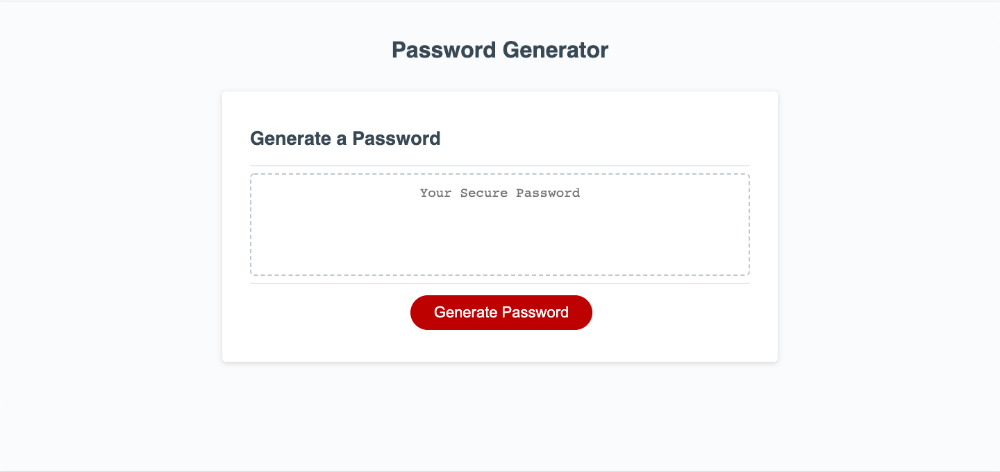

# Password Generator 

## Description
An application to generate a password based on user input.

## User Story
- WHEN I click the generate button
- THEN I am prompted for password length
- WHEN I enter password length
- THEN I am prompted to confirm if I want to include lowercase characters
- WHEN I confirm my lowercase character preferences
- THEN I am prompted to confirm if I want to include uppercase characters
- WHEN I confirm my uppercase character preferences
- THEN I am prompted to confirm if I want to include special characters
- WHEN I confirm my special character preferences
- THEN I am prompted to confirm if I want to include number characters
- WHEN I confirm my number character preferences
- THEN I am generated a password of my chosen length and character preferences

## Technologies Used
- HTML
- CSS
- Javascript

## License
The MIT License is a permissive free software license originating at the Massachusetts Institute of Technology (MIT) in the late 1980s. As a permissive license, it puts only very limited restriction on reuse and has, therefore, high license compatibility.

## Deployed Site
[Link](https://mbrunostem.github.io/password-generator/)

## Landing Page

## Contributors
Mario Bruno
* [GitHub](https://github.com/MBrunoStem)
* mbrunostem@gmail.com